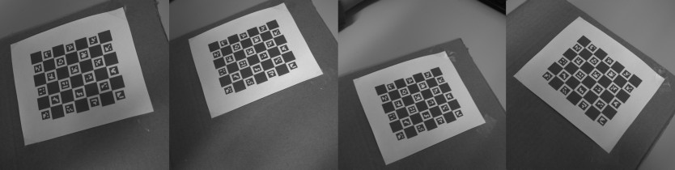
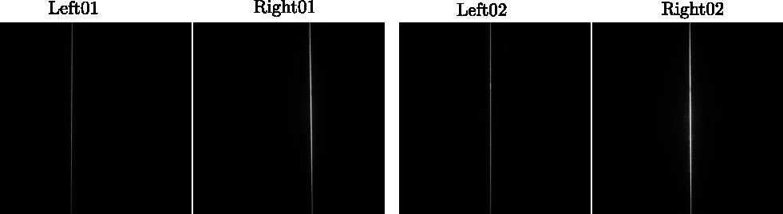

# Stereo camera laser

Scripts for calibrating and capturing images with a stereo laser scanner. 
The calibration gives the camera matrix and distortion coefficients of each camera,
as well as the rotation and translation between the cameras, and the laser plane.

## Camera calibration
### Print charuco board
To get the camera matrix of each camera, a charuco board must be printed. 
Use [create_charuco_board.py](calibration/create_charuco_board.py) with the following arguments
```bash
python create_charuco_board.py 
	--save_dir calib_dir # the directory the results will be saved to
	--aruco_dict_str DICT_APRILTAG_16H5  # Predefined aruco dictionary
	--sq_x 7 # number of horizontal squares
	--sq_y 6 # number of vertical squares
	--spacing_ratio # ratio between aruco markers and checkerboard squares
	--padding # pixels of padding around the checkerboard
	--px_width # total pixel width of the checkerboard
	--start_id # start id of the first marker on the checkerboard
	--min_brightness # brightness of the dark squares
```
For more options for the aruco_dict_str see [OpenCV docs](https://docs.opencv.org/3.4/d9/d6a/group__aruco.html#ggac84398a9ed9dd01306592dd616c2c975a6eb1a3e9c94c7123d8b1904a57193f16) 

### Capture images with each camera

Capture a 15-25 images of the charuco board with each camera and place the images from the left and right camera in 
directories like [cam-calib](calibration/calib-05-01/cam-calib). The images will be used to calibrate the camera matrix and distortion coefficients of each camera seperately.

### Capture images simultaniously with both cameras
Capture 5-10 images with both cameras simultaniously with the charuco board visible from both cameras like in [stereo-calib](calibration/calib-05-01/stereo-calib). The images will be used to calibrate the rotation and translation between each camera.

### Run the calibration script
To calibrate both the individual cameras and the transformation between them run [stereo_calib.py](calibration/stereo_calib.py)
```bash
python stereo_calib.py calib_dir
```
where the calib_dir have the following file structure
```bash
calib_dir
├── board.json
├── board.png
├── cam-calib
│    ├── left
│    │  ├── img01
│    │  ├── img02
│    │  └── ...
│    └── right
│       ├── img01
│       ├── img02
│       └── ...
│
└── stereo-calib
    ├── left
    │   ├── img01
    │   ├── img02
	│   └── ...
    └── right
        ├── img01
        ├── img02
        └── ...
---
```


## Laser calibration

To calibrate the laser, attach the bandpass filter to the cameras such that only the light from the laser is visible. Find a planar surface and capture 10-20 images where the laser line is visible from both cameras. It is important that the laser line is a straight line in all images. 
